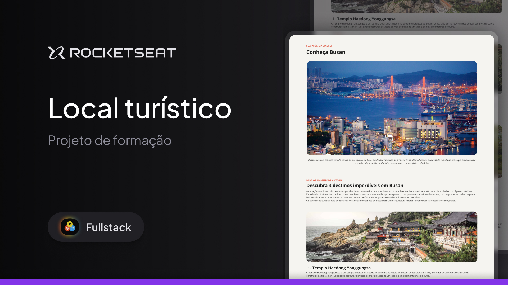

<h1 align="center"> Local Turístico </h1>

Desafio para desenvolver um web site so locais turísticos da cidade de Busan na Coreia do Sul.

    <a href="#-Tecnologias">Tecnologias</a>&nbsp;&nbsp;&nbsp;|&nbsp;&nbsp;&nbsp;
    <a href="#-projeto">Projeto</a>&nbsp;&nbsp;&nbsp;|&nbsp;&nbsp;&nbsp;
    <a href="#-layout">Layout</a>&nbsp;&nbsp;&nbsp;|&nbsp;&nbsp;&nbsp;
    <a href="#-licenca">Licença</a>&nbsp;&nbsp;&nbsp;|&nbsp;&nbsp;&nbsp;

 

  

 

  

## 🚀 Tecnologias

Esse projeto foi desenvolvido com as seguintes tecnologias:

- HTML e CSS
- Git e Github
- Figma

## 💻 Projeto

O projeto de um site do locais turistico da cidade de Busan, a estrela em ascensão da Coreia do Sul, oferece de tudo, desde churrascarias de primeira linha até tradicionais barracas de comida de rua. Aqui, exploramos a segunda cidade da Coreia do Sul e descobrimos as suas ofertas culinárias.

## 🔖 Layout

Fique por dentro do layout do através [DESSE LINK](https://www.figma.com/design/WmdZQUFd3JIpVEQliJMyqt/Local-Tur%C3%ADstico--Community-?node-id=908-1045&t=0139w9gzOWLsxZbl-0). É necessário ter conta no [Figma](https://figma.com) para acessá-lo.

## 📝 Licença

Esse projeto está sob a licença MIT. Veja o arquivo [LICENSE](.github/LICENSE.md) para mais detalhes.

---------

Feito com ♥ by Rocketseat 👋 [Participe da nossa comunidade!](https://discord.gg/rocketseat)